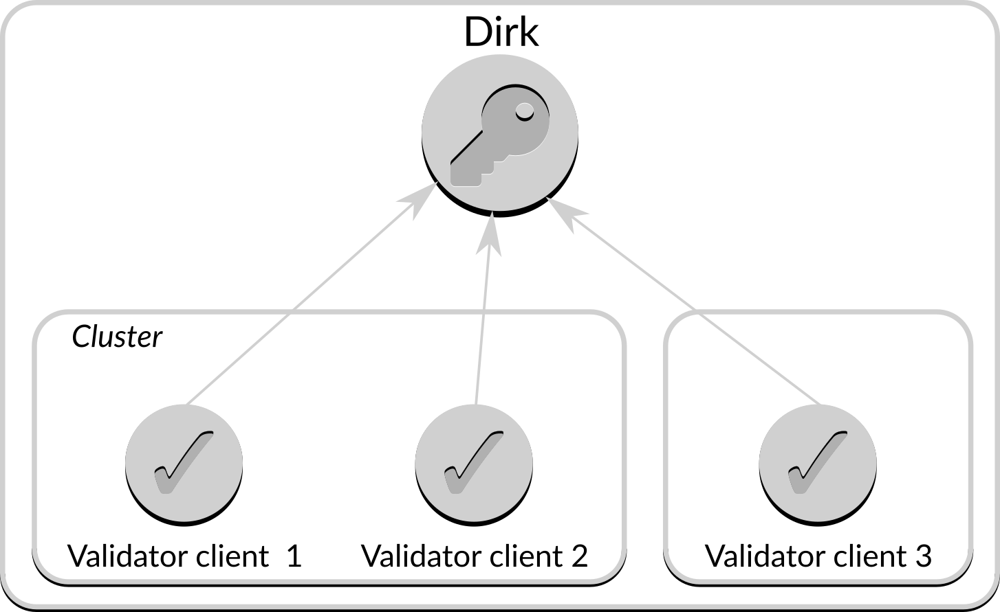

# Getting started

This document provides steps to set up a Dirk instance able to sign and protect multiple accounts.

### Example

The architecture we want to achieve is shown below:



In this architecture we have three validators clients.  Validator clients 1 and 2 are in a cluster, and between them manage accounts 1, 2, and 3.  Validator client 3 is standalone, and manages account 4.

#### Creating wallets and accounts
The first step is to create some wallets and validator keys for said wallets, using [ethdo](https://github.com/wealdtech/ethdo):

```sh
ethdo wallet create --wallet=wallet1
ethdo account create --account=wallet1/account1 --passphrase=secret
ethdo account create --account=wallet1/account2 --passphrase=secret
ethdo account create --account=wallet1/account3 --passphrase=secret
ethdo wallet create --wallet=wallet2
ethdo account create --account=wallet2/account4 --passphrase=secret
```

Here we have two wallets, one for each set of validator clients.  It is possible for different wallets to have different features, such as level of security and location, but for the purposes of this example they are both standard (non-deterministic) wallets (see ethdo documentation for other options).

#### Creating certificates
We need a certificate for the wallet daemon.  We could use a certificate from a well-known certificate authority such as LetsEncrypt, or we could create our own; we will create our own using OpenSSL.

> Note that creating and using certificates is a complicated process.  Please ensure that you understand what each of the following steps and parameters do before deploying to a production environment, as you may require different values.

First, we create the certificate authority.  Note the key created in this process is critical to the security of your deposits and should be protected with all reasonable measures; this should include a passphrase when promted.

```sh
openssl genrsa -des3 -out dirk_authority.key 4096
```

Once the key is generated we need to create the certificate itself:

```sh
openssl req -x509 -new -nodes -key dirk_authority.key -sha256 -days 1825 -out dirk_authority.crt
```

The server and each client need their own certificates.  The process for creating each certificate is the same, so follow the below process for each server and just change the name each time from `server.example.com` to whatever you need (e.g. `client1`, `client2`, `client3` for the above configuration).

First, create a key for the server in question:

```sh
openssl genrsa -out server.example.com.key 4096
```

Once the key is generated we need to create a file that contains details about the server name and the functions of the certificate.  Create a file `server.example.com.ext` with the following contents:

```
authorityKeyIdentifier=keyid,issuer
basicConstraints=CA:FALSE
keyUsage = digitalSignature, nonRepudiation, keyEncipherment, dataEncipherment
subjectAltName = @alt_names

[alt_names]
DNS.1 = server.example.com
```

The above is enough to create the server's certificate signing request:

```sh
openssl req -out server.example.com.csr -key server.example.com.key -new -subj "/CN=server.example.com" -addext "subjectAltName=DNS:server.example.com"
```

And this can then be signed by the certificate authority to generate the final valid certificate:

```sh
openssl x509 -req -in server.example.com.csr -CA dirk_authority.crt -CAkey dirk_authority.key -CAcreateserial -out server.example.com.crt -days 1825 -sha256 -extfile server.example.com.ext
```

The certificate content should be confirmed with:

```sh
openssl x509 -in server.example.com.crt -text -noout
```

If the above instructions have been followed the output from the above command should include:

```
X509v3 Subject Alternative Name:
  DNS:server.example.com
```

This information is required for Go programs (notably, Vouch) to validate connections to Dirk.

and the same commands can be used for the other clients, using "client1", "client2" and "client3" in place of "server.example.com".  At this point you should have the following files:

  - `client1.crt`: the signed certificate for client1; needs to be moved to the server running client1
  - `client1.csr`: the signing request for client1; can be deleted
  - `client1.ext`: the signing extension data for client1; can be deleted
  - `client1.key`: the key for client1; needs to be moved to the server running client1
  - `client2.crt`: the signed certificate for client2; needs to be moved to the server running client3
  - `client2.csr`: the signing request for client2; can be deleted
  - `client2.ext`: the signing extension data for client2; can be deleted
  - `client2.key`: the key for client2; needs to be moved to the server running client3
  - `client3.crt`: the signed certificate for client3; needs to be moved to the server running client3
  - `client3.csr`: the signing request for client3; can be deleted
  - `client3.ext`: the signing extension data for client3; can be deleted
  - `client3.key`: the key for client3; needs to be moved to the server running client3
  - `server.example.com.crt`: the certificate for `dirk`; needs to be moved to the server running `dirk`
  - `server.example.com.csr`: the signing request for `dirk`; can be deleted
  - `server.example.com.ext`: the signing extension data for `dirk`; can be deleted
  - `server.example.com.key`: the key for `dirk`; needs to be moved to the server running `dirk`
  - `dirk_authority.crl`: the certificate revocation list for dirk; needs to be copied to the server running `dirk`
  - `dirk_authority.crt`: the certificate for dirk; needs to be copied to all clients
  - `dirk_authority.key`: the key for dirk; needs to be copied to the server running `dirk`

To provide the certificates for `dirk` make a directory `dirk/security` in your home directory and copy the `server.example.com.crt` and `server.example.com.key` files in to it.  Also copy `dirk_authority.crt` to the same directory with the name `ca.crt`.  The contents of the `security` directory in your configuration directory should be:

  - `ca.crt`: copy of `dirk_authority.crt` from the previous step
  - `server.example.com.crt`: copy of `server.example.com.crt` from the previous step
  - `server.example.com.key`: copy of `server.example.com.key` from the previous step

At this point you also need a minimal configuration file so `dirk` knows which certificates to use.  Create a file `dirk.json` in your home directory with the following contents:

```json
{
  "server": {
    "id": 212483780,
    "name": "server.example.com",
    "listen-address": "localhost:9091"
  },
  "certificates": {
    "ca-cert": "file:///home/user/dirk/security/ca.crt",
    "server-cert": "file:///home/user/dirk/security/server.example.com.crt",
    "server-key": "file:///home/user/dirk/security/server.example.com.key"
  }
}
```

Note that you will need to change the "/home/user/" piece to point to your own home directory.

(The `id` and `listen-address` fields here will be explained later).

You can confirm the configuration of the certificates by running the command `dirk --show-certificates` which should return suitable information about the generated certificates:

```sh
dirk --show-certificates
```

which should give output like:

```
Server certificate issued by: Dirk authority
Server certificate expires: 2023-03-24 13:47:19 +0000 UTC
Server certificate issued to: server.example.com

Certificate authority certificate is: Dirk authority
Certificate authority certificate expires: 2023-03-24 13:47:20 +0000 UTC
```

#### Adding permissions
The next step is to configure `dirk` to know which clients have access to which accounts, and which operations on those accounts.  To do so, replace the `dirk.json` file above with the following:

```json
{
  "server": {
    "id": 212483780,
    "name": "server.example.com",
    "listen-address": "localhost:9091",
  },
  "certificates": {
    "ca-cert": "file:///home/user/dirk/security/ca.crt",
    "server-cert": "file:///home/user/dirk/security/server.example.com.crt",
    "server-key": "file:///home/user/dirk/security/server.example.com.key"
  },
  "permissions": {
    "client1": {
      "wallet1": "All"
    },
    "client2": {
      "wallet1": "All"
    },
    "client3": {
      "wallet2": "All"
    }
  }
}
```

Once this is in place it can be confirmed by running `dirk --show-permissions`:

```sh
dirk --show-permissions

```

which should give output like:

```
Permissions for "client1":
 - accounts matching the path "wallet1" can carry out all operations
Permissions for "client2":
 - accounts matching the path "wallet1" can carry out all operations
Permissions for "client3":
 - accounts matching the path "wallet2" can carry out all operations
```

Permissions can be used to restrict the access of clients to wallets, accounts, and operations.  More details can be found in ther permissions documentation.

#### Starting `dirk`

To start `dirk` type:

```sh
dirk
```

which should give output like:

```json
{"level":"info","version":"v0.1.0","time":"2020-07-27T23:20:51+01:00","message":"Starting dirk"}
{"level":"warn","time":"2020-07-27T23:20:51+01:00","message":"No stores configured; using default"}
{"level":"info","service":"api","impl":"grpc","address":"localhost:9091","time":"2020-07-27T23:20:51+01:00","message":"Listening"}
{"level":"info","time":"2020-07-27T23:20:51+01:00","message":"All services operational"}
```

At this point `dirk` is operational on port 9091 and can accept requests for key generation, signing _etc._

#### Testing client permissions
`ethdo` interacts with the dirk using additional options:
  -  `--remote` the address of the Dirk instance
  - `--client-cert` and `--client-key` the path to the certificate and keyfile for the client
  - `--ca-cert` the path to the certificate for the server authority

For example, to list accounts accessible in `wallet1` with the `client1` certificate:

```sh
ethdo --remote=server.example.com:9091 --client-cert=client1.crt --client-key=client1.key --server-ca-cert=dirk_authority.crt wallet accounts --wallet=wallet1
```

which should give output like:

```
account1
account3
account2
```

As would be expected from the configured permissions, `client3` cannot access the accounts in `wallet1`:

```sh
ethdo --remote=server.example.com:9091 --client-cert=client3.crt --client-key=client3.key --server-ca-cert=Wallet_daemon_authority.crt wallet accounts --wallet=wallet1
```

At this point it has been confirmed that the client permissions operate as expected, and that dirk is appropriately configured.  The client certificates can now be used by validators to remotely access their keys.
